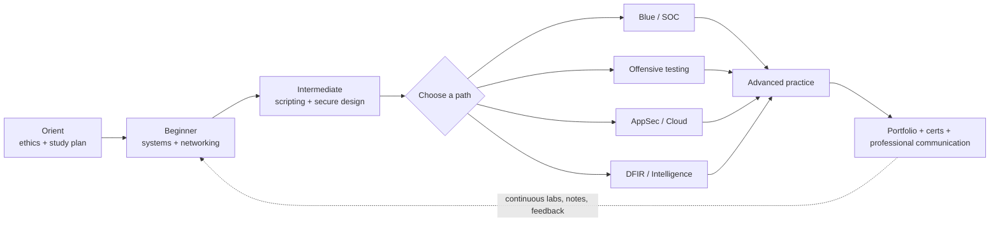
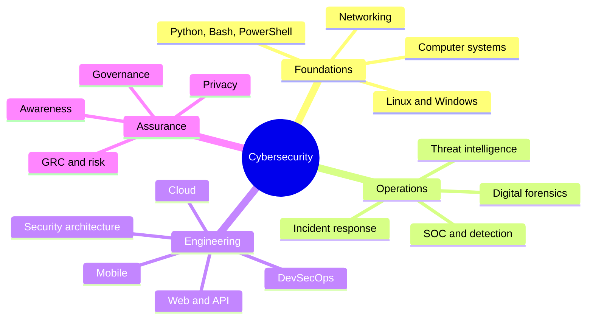
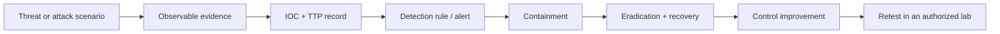

# Beginner-to-Advanced Cybersecurity Roadmap

> A practical, ethical learning path from first principles to professional security engineering.

This is a self-paced curriculum, not a promise of a job or a list of exploit
recipes. Build skills in an isolated lab, obtain permission before testing, and
document both the risk and the fix.

## Visual map

### Skill graph

## Start here

1. Read the [safe-lab rules](docs/lab-safety.md) and choose a pace in
   [study plans](docs/study-plans.md).
2. Complete [foundations](phases/01-foundations/README.md), then
   [core skills](phases/02-core-skills/README.md).
3. Pick one [specialization](phases/03-specializations/README.md); keep the
   other domains as supporting literacy.
4. Build evidence with the [project ladder](projects/README.md), track progress,
   and use [career guidance](career/README.md).

## Domain map

| Domain group | What to practice | Detailed guides |
| --- | --- | --- |
| Foundations | Systems, networking, Linux/Windows, programming and cryptography | [Domain index](domains/README.md) |
| Offensive and defensive operations | Authorized testing, SOC triage, blue/purple-team detection | [Offensive](domains/offensive/README.md), [Defensive SOC](domains/defensive-soc/README.md) |
| Applications and platforms | Web/API, cloud, mobile, wireless, IoT/OT and AI security | [Application and platform domains](domains/README.md) |
| Investigation and response | DFIR, incident response, malware and threat intelligence | [Operations domains](domains/README.md) |
| Governance and resilience | GRC, risk, architecture, DevSecOps, awareness and privacy | [Assurance domains](domains/README.md) |

## Curriculum

| Stage | Outcome | Guide |
| --- | --- | --- |
| Foundations | Explain computers, networks, Linux and Windows | [Phase 1](phases/01-foundations/README.md) |
| Core skills | Script, secure applications, use logs and crypto safely | [Phase 2](phases/02-core-skills/README.md) |
| Specialization | Operate, test or investigate systems responsibly | [Phase 3](phases/03-specializations/README.md) |
| Advanced | Design security for cloud, software and organizations | [Advanced domains](advanced/README.md) |
| Professional | Show repeatable outcomes and communicate risk | [Career](career/README.md) |

## Attack-to-defense map

Use [attack knowledge](attack-knowledge/README.md) for beginner,
intermediate, and advanced scenarios. It explains impact, indicators,
detection, prevention, mitigation, and response without weaponized procedures.

## Frameworks to learn

| Framework or standard | Why it matters | Official reference |
| --- | --- | --- |
| MITRE ATT&CK | Common language for adversary behaviors and detections | [attack.mitre.org](https://attack.mitre.org/) |
| NIST CSF 2.0 | Organizes cybersecurity outcomes and risk conversations | [NIST CSF](https://www.nist.gov/cyberframework) |
| OWASP | Practical application and API security guidance | [OWASP](https://owasp.org/) |
| CIS Controls | Prioritized safeguards for organizations | [CIS Controls](https://www.cisecurity.org/controls) |
| ISO/IEC 27001 | Information security management system requirements | [ISO overview](https://www.iso.org/isoiec-27001-information-security.html) |

## Reference sections

- [Attack knowledge, mapped to defense](attack-knowledge/README.md)
- [Projects and home labs](projects/README.md)
- [Certifications and career paths](career/certifications.md)
- [Curated resources](resources/README.md)
- [Progress template](templates/progress.md)

## Trusted learning links

- **Free courses and documentation:** [CISA training](https://www.cisa.gov/resources-tools/training),
  [NIST publications](https://csrc.nist.gov/publications),
  [Microsoft Learn security](https://learn.microsoft.com/security/),
  [Cisco Networking Academy](https://www.netacad.com/).
- **Books and references:** [The Linux Command Line](https://linuxcommand.org/tlcl.php),
  [OWASP Cheat Sheet Series](https://cheatsheetseries.owasp.org/),
  [Google SRE books](https://sre.google/books/).
- **Practice labs and CTFs:** [PortSwigger Web Security Academy](https://portswigger.net/web-security),
  [picoCTF](https://picoctf.org/), [OverTheWire](https://overthewire.org/wargames/),
  [TryHackMe](https://tryhackme.com/), [Hack The Box Academy](https://academy.hackthebox.com/).
- **Threat and vulnerability intelligence:** [CISA advisories](https://www.cisa.gov/news-events/cybersecurity-advisories),
  [KEV catalog](https://www.cisa.gov/known-exploited-vulnerabilities-catalog),
  [SANS Internet Storm Center](https://isc.sans.edu/).

## Safety and scope

Only assess assets you own or have explicit written authorization to test.
Never use credentials, personal data, persistence, evasion, or disruption in a
learning exercise. Prefer purpose-built targets such as OWASP Juice Shop,
WebGoat, Metasploitable, or CTF platforms; keep them off the public Internet.
Report weaknesses privately and include remediation and verification steps.

## Contributing

Content should be reproducible, dated when it may change, and link to primary
sources. See [CONTRIBUTING.md](CONTRIBUTING.md), [CODE_OF_CONDUCT.md](CODE_OF_CONDUCT.md),
and [SECURITY.md](SECURITY.md).
