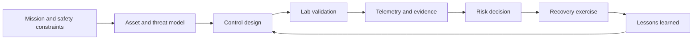

# Advanced practice

Advanced study means designing controls, validating assumptions, and leading
safe outcomes across people, process, and technology. Choose one track for a
term, keep an evidence journal, and publish a sanitized report with limitations.
Start with the [domain index](../domains/README.md), then use the focused
tracks below.

## Track map

| Track | Advanced outcome | Guide |
| --- | --- | --- |
| Cloud security | Govern identity, workloads, data, and recovery across accounts | [Cloud security](cloud-security/README.md) |
| DevSecOps and supply chain | Make secure delivery measurable and repeatable | [DevSecOps](devsecops/README.md) |
| Malware analysis | Produce safe behavioral evidence from suspicious files | [Malware analysis](malware-analysis/README.md) |
| Threat intelligence | Turn uncertain reporting into defensible decisions | [Threat intelligence](threat-intelligence/README.md) |
| Architecture and resilience | Design trust boundaries, zero trust, and recovery | [Security architecture](../domains/security-architecture/README.md) |
| OT/IoT and AI | Protect safety-critical and model-enabled workflows | [IoT/OT](../domains/iot-ot/README.md), [AI security](../domains/ai-security/README.md) |

## Advanced operating loop

## Evidence standard

For every advanced project, retain:

- scope, authorization, assumptions, and stop conditions;
- architecture or data-flow diagram and abuse/threat cases;
- control objective, implementation, test data, and expected result;
- detection logic, IOC/TTP handling, confidence, and privacy review;
- residual risk, owner, recovery objective, and retest date.

Use primary guidance from [NIST publications](https://csrc.nist.gov/publications),
[CISA](https://www.cisa.gov/), [ENISA](https://www.enisa.europa.eu/), and
[MITRE ATT&CK](https://attack.mitre.org/). Advanced work still requires
authorization, reversible experiments, and defensive outcomes.
