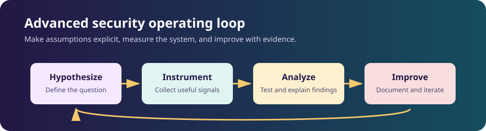
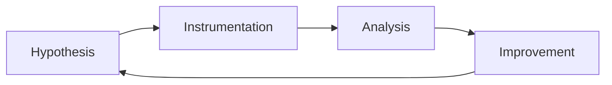

# Advanced cloud security

## Concepts

Study multi-account governance, identity attack paths, workload isolation,
data protection, control-plane logging, resilience, shared responsibility, and
cloud incident response.

## Tools and safe labs

Use provider-native audit logs, IAM analyzers, policy-as-code, CSPM findings,
Terraform, and a disposable sandbox account. Set budget alerts, deny
production access, use synthetic data, and delete resources after each lab.

## Project

Build a multi-account landing-zone review: diagram trust boundaries, implement
least-privilege roles and centralized logging, test a denied action, and report
residual risk and recovery evidence.

## Attacks and threats

Consider exposed storage, stolen tokens, over-privileged roles, metadata-service
abuse, supply-chain images, and destructive automation. Discuss scenarios only;
do not test accounts or endpoints without written authorization.

## Detection and IOCs/TTPs

Review impossible-travel sign-ins, new access keys, policy changes, unusual
regions, anomalous API sequences, public resource exposure, and unexpected
control-plane activity. Record source, timestamp, asset, confidence, and ATT&CK
mapping without retaining secrets.

## Prevention and mitigation

Use phishing-resistant MFA, short-lived roles, permission boundaries, network
segmentation, encryption with managed keys, immutable backups, workload
hardening, policy-as-code, and tested break-glass procedures.

## Frameworks and use cases

Use the [Cloud Security Alliance CCM](https://cloudsecurityalliance.org/research/cloud-controls-matrix),
[NIST SP 800-207](https://csrc.nist.gov/pubs/sp/800/207/final), provider
well-architected guidance, and [CIS Benchmarks](https://www.cisecurity.org/cis-benchmarks).
Use cases include landing-zone assurance, cloud detection engineering, and
recovery exercises.
