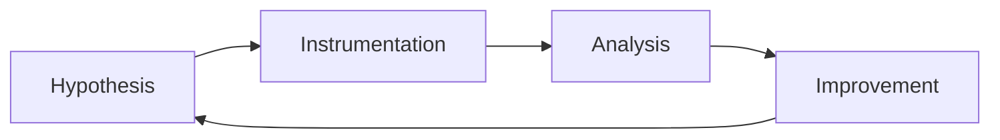

# Advanced DevSecOps and supply-chain security

## Concepts

Learn threat modeling in delivery pipelines, provenance, SBOMs, dependency
governance, secrets management, artifact integrity, environment promotion, and
secure-by-default developer experience.

## Tools and safe labs

Use GitHub or GitLab security features, Semgrep, Trivy, dependency scanners,
OpenSSF Scorecard, Sigstore Cosign, and an ephemeral CI runner. Test only
sample repositories and synthetic credentials.

## Project

Create a secure pipeline for a small service: generate an SBOM, scan code and
dependencies, sign an artifact, enforce review gates, and document a controlled
exception path.

## Attacks and threats

Model dependency confusion, compromised maintainers, leaked tokens, malicious
pull requests, poisoned images, and tampered artifacts. Keep demonstrations
local and non-deployable.

## Detection and IOCs/TTPs

Monitor workflow-file changes, unusual runner behavior, new maintainers,
dependency drift, unsigned artifacts, secret-scanner findings, and unexpected
egress. Correlate commit, build, registry, and deployment identities.

## Prevention and mitigation

Pin and review dependencies, use provenance and signatures, isolate runners,
rotate secrets, apply branch protection, separate duties, minimize token scopes,
and maintain a tested rollback path.

## Frameworks and use cases

Use [NIST SSDF](https://csrc.nist.gov/pubs/sp/800/218/final),
[SLSA](https://slsa.dev/), [OpenSSF](https://openssf.org/), and
[OWASP SAMM](https://owaspsamm.org/). Use cases include release assurance,
vulnerability triage, and software supply-chain risk reviews.
