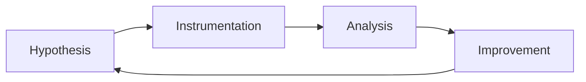

# Advanced malware analysis

## Concepts

Study file formats, execution chains, persistence, command-and-control
behaviors, unpacking concepts, behavioral evidence, and analyst confidence.

## Tools and safe labs

Use an isolated, non-routable detonation VM with snapshots, Procmon,
Wireshark, YARA, Ghidra, and Volatility. Never use personal files, real
credentials, shared folders, or bridged networking.

## Project

Analyze a benign training sample or vendor-provided report, create a timeline,
write a small defensive YARA rule, extract redacted indicators, restore the VM,
and verify cleanup.

## Attacks and threats

Cover loaders, ransomware behavior, credential stealers, macro abuse, and
living-off-the-land activity as observable scenarios rather than payloads.

## Detection and IOCs/TTPs

Capture hashes, signer metadata, parent-child process anomalies, persistence
locations, DNS patterns, file changes, and mutex or service clues. Label each
indicator with source, time, confidence, and ATT&CK technique.

## Prevention and mitigation

Use application allowlisting, EDR, least privilege, patching, macro controls,
segmentation, email filtering, immutable backups, and tested isolation playbooks.

## Frameworks and use cases

Use [MITRE ATT&CK Software](https://attack.mitre.org/software/),
[YARA documentation](https://yara.readthedocs.io/), [CISA guidance](https://www.cisa.gov/),
and [NIST SP 800-61](https://csrc.nist.gov/pubs/sp/800/61/r2/final). Use cases
include triage, detection-content development, and threat hunting.
