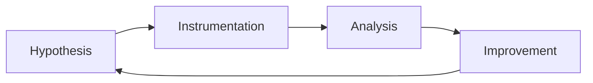

# Advanced threat intelligence

## Concepts

Learn intelligence requirements, collection planning, source evaluation,
confidence grading, pivoting, campaign analysis, sharing standards, and the
difference between indicators, behaviors, and assessments.

## Tools and safe labs

Use ATT&CK, STIX/TAXII-compatible tools, MISP, OpenCTI, passive DNS datasets,
and vendor reports. Work from public or synthetic data and respect licensing,
privacy, and operational-security boundaries.

## Project

Produce a time-bounded intelligence brief: define an intelligence requirement,
compare at least three sources, map behaviors to ATT&CK, record confidence and
gaps, and recommend prioritized defensive actions.

## Attacks and threats

Analyze phishing campaigns, ransomware groups, cloud abuse, supply-chain
incidents, and influence operations at the campaign level. Do not publish
targeting guidance or actionable personal data.

## Detection and IOCs/TTPs

Normalize domains, hashes, IPs, URLs, and behavioral patterns; record first and
last seen, source, confidence, relationships, and expiration. Validate indicators
before operationalizing them to reduce false positives.

## Prevention and mitigation

Use intelligence-led patching, control tuning, blocklists with expiry,
user-awareness exercises, segmentation, and prioritized remediation tied to
business risk.

## Frameworks and use cases

Use [MITRE ATT&CK](https://attack.mitre.org/), [STIX 2.1](https://oasis-open.github.io/cti-documentation/stix/intro),
[TAXII](https://oasis-open.github.io/cti-documentation/taxii/intro), and
[CISA KEV](https://www.cisa.gov/known-exploited-vulnerabilities-catalog). Use
cases include executive briefs, detection enrichment, and vulnerability
prioritization.
