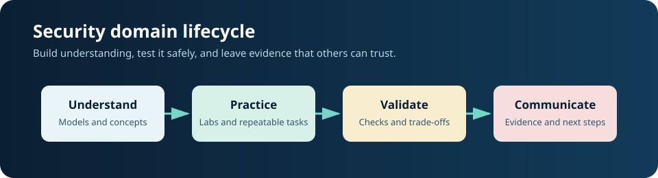
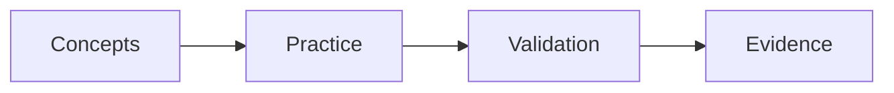

# Security Architecture

## Concepts

Study the domain's assets, trust boundaries, workflows, security properties, risk, and recovery.

## Tools and safe labs

Use STRIDE, attack trees, diagrams, ADRs. Build a disposable, host-only lab with snapshots, synthetic data, least privilege, and explicit authorization. Practice a baseline, introduce one harmless test condition, collect evidence, restore, and verify.

## Project

Create a sanitized design review project: define scope and assumptions, draw the architecture or data flow, implement a control, test it, and publish impact, remediation, verification, and limitations.

## Attacks and threats

Common risks include boundary bypass, insecure defaults, single points of failure. Discuss them as scenarios and controls; do not target public systems or publish weaponized procedures.

## Detection and IOCs/TTPs

Monitor relevant logs, identity and process events, configuration changes, network metadata, and control failures. Record indicator type, source, timestamp/time zone, affected asset, confidence, and mapped MITRE ATT&CK tactic/technique. Indicators are clues, not proof; remove secrets and personal data.

## Prevention and mitigation

Use least privilege, secure defaults, patching, segmentation, MFA, validated inputs, protected secrets, backups, monitoring, change review, and rehearsed recovery as applicable. Prefer reversible controls and verify that fixes work.

## Frameworks and use cases

Relevant frameworks: NIST SP 800-160; NIST SP 800-207; SAMM. Use cases include design review, incident exercises, control assurance, and communicating risk to technical and non-technical audiences.

## Deliverable checklist

- [ ] scope, authorization, safety boundaries, and cleanup plan
- [ ] concepts and threat model with assumptions
- [ ] tools, evidence, IOCs/TTPs, confidence, and data handling
- [ ] detection, prevention, mitigation, and retest results
- [ ] sanitized report with links to primary guidance

